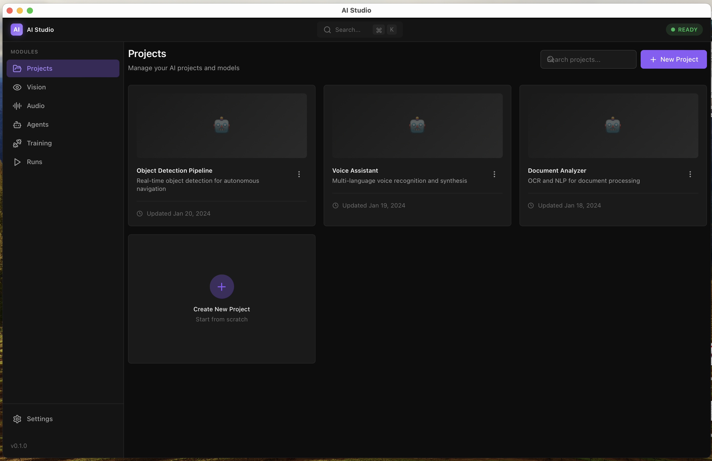
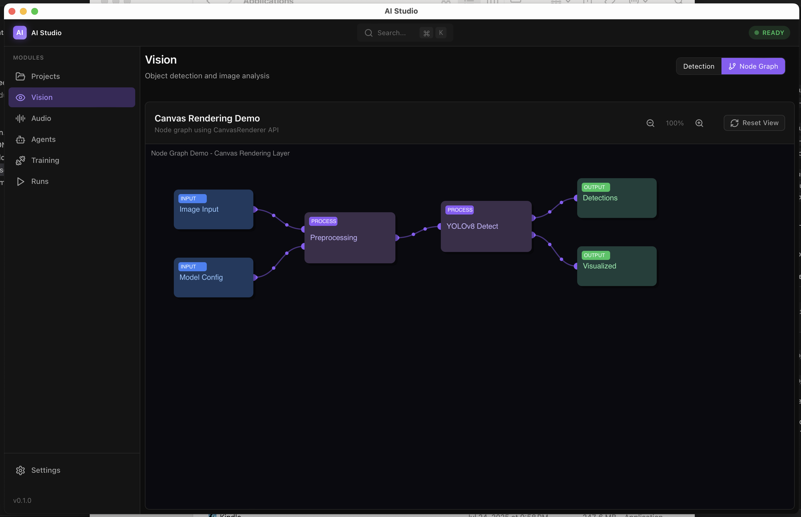
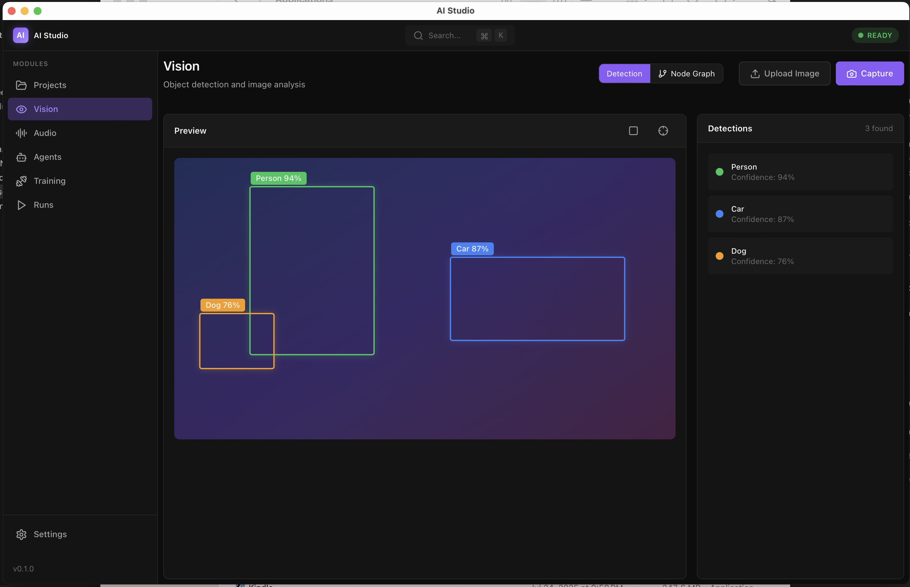
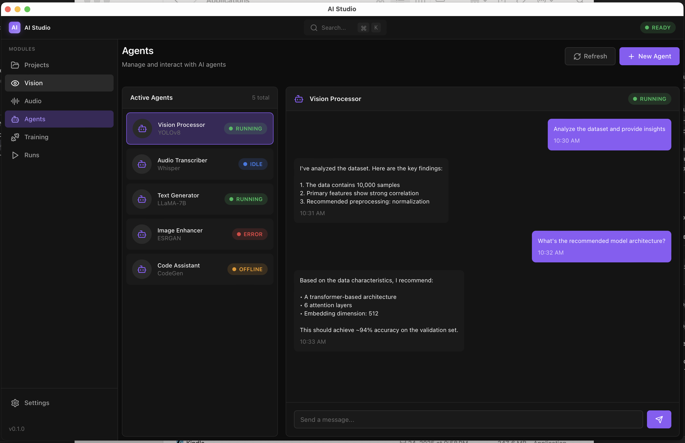
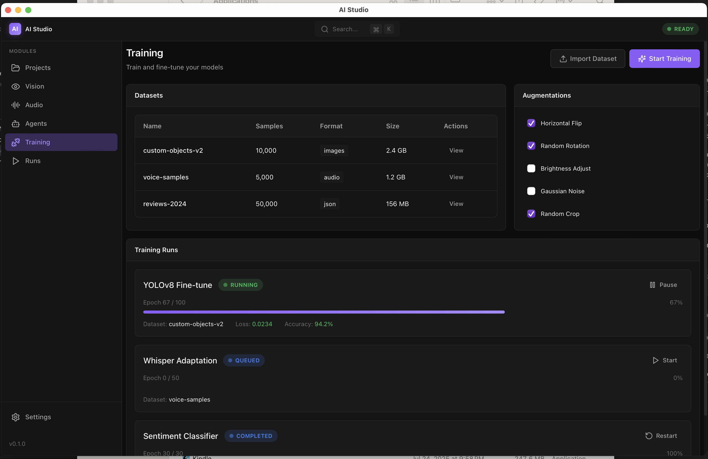
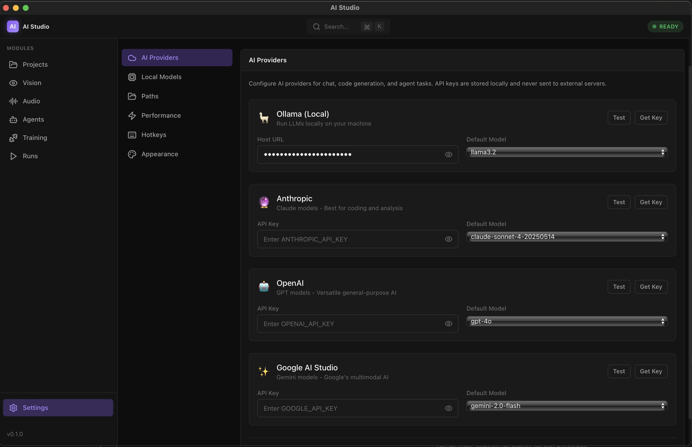

<p align="center">
  
</p>

<h1 align="center">🧠 AI Studio</h1>

<p align="center">
  <strong>Your Personal AI Assistant. Any OS. Any Provider. Local-First.</strong>
</p>

<p align="center">
  A production-grade, cross-platform AI desktop application built with <b>Tauri + React + TypeScript</b>.<br>
  Run LLMs locally, connect to cloud providers, and take full control of your AI experience.
</p>

<p align="center">
  <a href="#-features">Features</a> •
  <a href="#-screenshots">Screenshots</a> •
  <a href="#-installation-guide">Install</a> •
  <a href="#%EF%B8%8F-architecture">Architecture</a> •
  <a href="#-ai-agent-infrastructure">AI Agent</a>
</p>

---

> 🎯 **Purpose**: Architecture + scaffolding for a 5-10 year foundation. Not a fully working product, but a professional starting point.

## Features

- ✅ **Cross-platform**: macOS, Windows, Linux
- ✅ **Professional GUI**: Node graphs, timelines, media panels
- ✅ **GPU-ready**: Canvas/WebGL now, WebGPU architecture ready
- ✅ **Clean separation**: UI, OS access, AI, and rendering layers
- ✅ **Extensible**: Vision, Audio, Agents, Training, Projects
- ✅ **Mock-first**: All data mocked for rapid prototyping

---

## 📸 Screenshots

### Main Dashboard


### Canvas Demo (Node Graph)


### Vision Module


### Agents


### Training


### Settings - AI Providers


---

## 🚀 Installation Guide

### Prerequisites

| Tool | Version | Purpose |
|------|---------|---------|
| **Node.js** | 18+ | JavaScript runtime |
| **npm** | 9+ | Package manager |
| **Rust** | Latest stable | Native desktop shell (Tauri) |
| **Python** | 3.10+ | AI sidecar (optional) |

### Step 1: Install Node.js

If not installed, download from [nodejs.org](https://nodejs.org/) or use:

```bash
# macOS (Homebrew)
brew install node

# Windows (Chocolatey)
choco install nodejs
```

### Step 2: Install Rust (Required for Desktop App)

Rust is needed to compile the native Tauri shell:

```bash
# macOS / Linux
curl --proto '=https' --tlsv1.2 -sSf https://sh.rustup.rs | sh

# When prompted, select: 1) Proceed with standard installation
```

After installation, **restart your terminal** or run:
```bash
source ~/.cargo/env
```

Verify installation:
```bash
rustc --version
# Should show: rustc 1.XX.X
```

### Step 3: Install Tauri CLI

```bash
cargo install tauri-cli
```

> ⏱️ First time takes ~2-3 minutes (compiles 700+ crates)

### Step 4: Clone & Install Dependencies

```bash
git clone <your-repo-url>
cd ai-studio-template
npm install
```

---

## 🏃 Running the Application

### Option A: Browser Only (Quick Development)

Best for UI development without Rust:

```bash
npm run dev
# Opens at http://localhost:1420
```

### Option B: Native Desktop App (Full Experience)

Runs as a real macOS/Windows/Linux application:

```bash
npm run tauri:dev
```

> ⏱️ First build takes ~3-5 minutes (compiles Rust dependencies)  
> Subsequent runs are instant.

### Option C: Run AI Agent Backend

The AI sidecar is a **multi-provider LLM agent** with local and cloud support:

```bash
# Install dependencies
cd apps/sidecar && pip install -r requirements.txt

# Run the agent server
python server.py
# API docs at: http://localhost:8765/docs
```

### Option D: Docker Compose (Recommended for Local LLM)

Run everything with Docker, including Ollama for local LLM:

```bash
# CPU mode
docker compose up

# GPU mode (requires nvidia-container-toolkit)
docker compose --profile gpu up

# With Telegram bot
TELEGRAM_BOT_TOKEN=your_token docker compose --profile telegram up
```

---

## 🤖 AI Agent Infrastructure

### Multi-Provider LLM Support

The sidecar supports multiple LLM providers:

| Provider | Type | Configuration |
|----------|------|---------------|
| **Ollama** | Local | `OLLAMA_HOST`, `OLLAMA_MODEL` |
| **Anthropic** | Cloud | `ANTHROPIC_API_KEY` |
| **OpenAI** | Cloud | `OPENAI_API_KEY` |
| **Google AI** | Cloud | `GOOGLE_API_KEY` |

### Tools API

The agent includes tools for shell commands, browser automation, and filesystem access:

```bash
# Execute shell commands
curl -X POST http://localhost:8765/tools/shell \
  -H "Content-Type: application/json" \
  -d '{"command": "ls -la"}'

# Read a file
curl -X POST http://localhost:8765/tools/filesystem \
  -H "Content-Type: application/json" \
  -d '{"action": "read", "path": "README.md"}'

# Browser automation (start, navigate, screenshot)
curl -X POST http://localhost:8765/tools/browser/start
curl -X POST http://localhost:8765/tools/browser \
  -H "Content-Type: application/json" \
  -d '{"action": "navigate", "url": "https://example.com"}'
```

### API Endpoints

```bash
# Chat with conversation memory
curl -X POST http://localhost:8765/chat \
  -H "Content-Type: application/json" \
  -d '{"message": "Hello!", "provider": "ollama"}'

# List available providers
curl http://localhost:8765/providers

# Health check
curl http://localhost:8765/status
```

### Telegram Bot Integration

1. Create a bot via [@BotFather](https://t.me/BotFather) on Telegram
2. Set your bot token:
   ```bash
   export TELEGRAM_BOT_TOKEN=your_token
   ```
3. Run the bot:
   ```bash
   cd apps/sidecar
   python -m channels.telegram
   ```

**Bot Commands:**
- `/start` - Show help
- `/clear` - Clear conversation
- `/provider <name>` - Switch provider
- `/model <name>` - Set model
- `/status` - Show settings

---

## 📁 Project Structure

```
ai-studio-template/
├── apps/
│   ├── desktop/              # Tauri + Rust backend
│   │   └── src-tauri/
│   │       ├── src/
│   │       │   ├── main.rs       # Entry point
│   │       │   ├── lib.rs        # Core logic
│   │       │   ├── commands.rs   # IPC handlers
│   │       │   └── system.rs     # OS info
│   │       └── tauri.conf.json
│   │
│   ├── ui/                   # React + TypeScript + Vite
│   │   ├── src/
│   │   │   ├── app/
│   │   │   │   ├── layout/       # Shell, Header, Sidebar
│   │   │   │   └── pages/        # Module pages
│   │   │   ├── canvas/           # Rendering abstraction
│   │   │   ├── state/            # Zustand store
│   │   │   └── commands/         # Keyboard shortcuts
│   │   └── vite.config.ts
│   │
│   └── sidecar/              # AI Agent Backend (Multi-Provider LLM)
│       ├── agent/
│       │   ├── providers/       # Ollama, Anthropic, OpenAI
│       │   └── chat.py          # Chat service with memory
│       ├── channels/
│       │   └── telegram.py      # Telegram bot integration
│       ├── server.py            # FastAPI server
│       ├── Dockerfile
│       └── requirements.txt
│
├── packages/
│   └── shared/               # Shared types & schemas
│
├── data/
│   └── sample-projects/      # Mock project data
│
└── package.json              # Monorepo workspace config
```

---

## 🎨 UI Modules

| Module | Description | Key Features |
|--------|-------------|--------------|
| **Projects** | Project management | List, create, open, JSON persistence |
| **Vision** | Image analysis | Preview canvas, detection overlays |
| **Audio** | Audio processing | Waveform display, transcription |
| **Agents** | AI agent management | Status monitoring, chat interface |
| **Training** | Model training | Dataset management, progress tracking |
| **Runs** | Pipeline execution | Phase timeline, live logs |
| **Settings** | Configuration | Models, paths, hotkeys, appearance |

---

## ⌨️ Keyboard Shortcuts

| Shortcut | Action |
|----------|--------|
| `⌘K` / `Ctrl+K` | Open Command Palette |
| `⌘1-6` | Navigate to modules |
| `⌘,` | Open Settings |
| `⌘N` | New Project |

---

## 🏗️ Architecture

```
┌─────────────────────────────────────────────────────────────────┐
│                        AI STUDIO                                │
├─────────────────────────────────────────────────────────────────┤
│  ┌─────────────────────────────────────────────────────────┐   │
│  │                    React UI Layer                        │   │
│  │  ┌─────────┐ ┌─────────┐ ┌─────────┐ ┌─────────┐        │   │
│  │  │Projects │ │ Vision  │ │ Agents  │ │Training │  ...   │   │
│  │  └────┬────┘ └────┬────┘ └────┬────┘ └────┬────┘        │   │
│  │       │           │           │           │              │   │
│  │  ┌────┴───────────┴───────────┴───────────┴────┐        │   │
│  │  │           State Management (Zustand)         │        │   │
│  │  └─────────────────────┬───────────────────────┘        │   │
│  │                        │                                 │   │
│  │  ┌─────────────────────┴───────────────────────┐        │   │
│  │  │        Canvas Rendering Layer               │        │   │
│  │  │  ┌──────────────┐    ┌──────────────────┐   │        │   │
│  │  │  │CanvasRenderer│    │WebGPURenderer.stub│  │        │   │
│  │  │  └──────────────┘    └──────────────────┘   │        │   │
│  │  └─────────────────────────────────────────────┘        │   │
│  └─────────────────────────────────────────────────────────┘   │
├─────────────────────────────────────────────────────────────────┤
│  ┌──────────────────┐              ┌──────────────────┐        │
│  │   Tauri / Rust   │◄────IPC────►│  Python Sidecar  │        │
│  │   (OS Access)    │              │  (AI Inference)  │        │
│  └──────────────────┘              └──────────────────┘        │
└─────────────────────────────────────────────────────────────────┘
```

---

## 🛠️ Tech Stack

| Layer | Technology | Purpose |
|-------|------------|---------|
| Desktop Shell | Tauri 2.0 + Rust | Native OS access, windowing |
| UI Framework | React 19 + TypeScript | Component-based UI |
| Build Tool | Vite 7 | Fast HMR, optimized builds |
| Styling | Tailwind CSS 4 | Utility-first CSS |
| State | Zustand | Lightweight state management |
| Rendering | Canvas 2D (abstracted) | Node graphs, timelines |
| AI Interface | Python HTTP Server | Future ML integration |

---

## 🔧 Troubleshooting

### "cargo: command not found"
```bash
source ~/.cargo/env
# Or restart your terminal
```

### "Port 1420 is already in use"
```bash
# Kill the process using the port
lsof -ti:1420 | xargs kill -9
```

### Rust compilation taking too long
First-time compilation is slow (~3-5 min). Subsequent builds are fast.

---

## 📦 Building for Production

```bash
# Build production bundle
npm run tauri:build
```

This creates platform-specific installers in `apps/desktop/src-tauri/target/release/bundle/`.

### macOS Installation

1. Build creates:
   - `bundle/macos/AI Studio.app` - Application bundle
   - `bundle/dmg/AI Studio_X.X.X_aarch64.dmg` - Installer disk image

2. **Install via DMG (Recommended)**:
   ```bash
   # Open the DMG
   open apps/desktop/src-tauri/target/release/bundle/dmg/AI\ Studio_*.dmg
   # Drag "AI Studio" to Applications folder
   ```

3. **Or copy directly**:
   ```bash
   cp -r "apps/desktop/src-tauri/target/release/bundle/macos/AI Studio.app" /Applications/
   ```

4. **First launch**: Right-click → Open (bypasses Gatekeeper for unsigned apps)

### Windows Installation

1. Build creates:
   - `bundle/msi/AI Studio_X.X.X_x64_en-US.msi` - MSI installer
   - `bundle/nsis/AI Studio_X.X.X_x64-setup.exe` - NSIS installer

2. **Install via MSI**:
   - Double-click the `.msi` file
   - Follow the installation wizard
   - App installs to `C:\Program Files\AI Studio\`

3. **Or run portable**:
   - Use `target/release/ai-studio.exe` directly

### Linux Installation

1. Build creates:
   - `bundle/deb/ai-studio_X.X.X_amd64.deb` - Debian package
   - `bundle/appimage/ai-studio_X.X.X_amd64.AppImage` - Portable AppImage

2. **Install via .deb (Debian/Ubuntu)**:
   ```bash
   sudo dpkg -i apps/desktop/src-tauri/target/release/bundle/deb/ai-studio_*.deb
   # Fix dependencies if needed:
   sudo apt-get install -f
   ```

3. **Or run AppImage (Any distro)**:
   ```bash
   chmod +x apps/desktop/src-tauri/target/release/bundle/appimage/ai-studio_*.AppImage
   ./ai-studio_*.AppImage
   ```

---

## License

MIT

---

Built with ❤️ using Tauri, React, and TypeScript.
