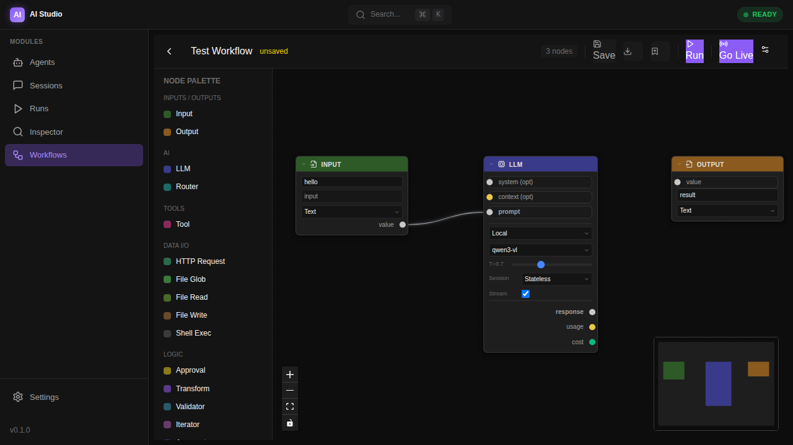
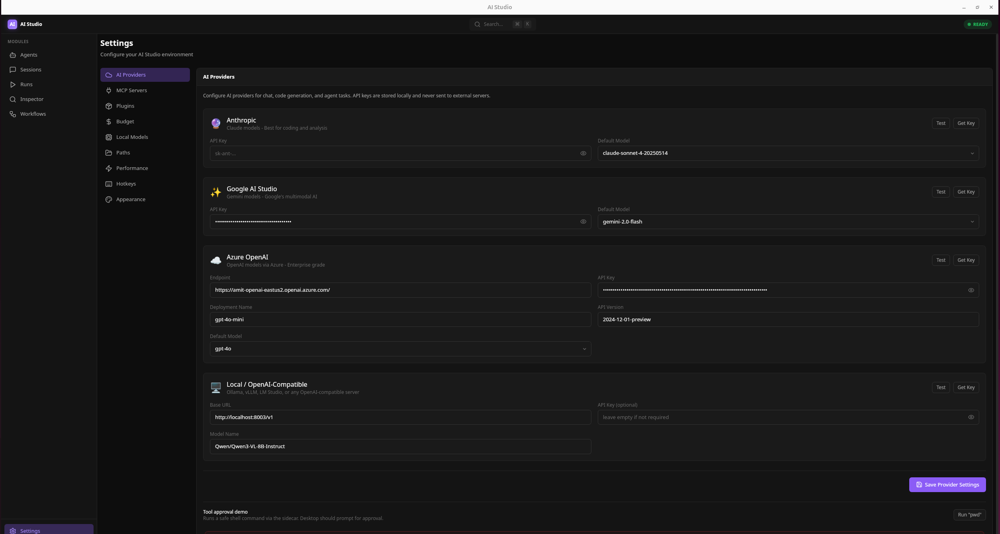
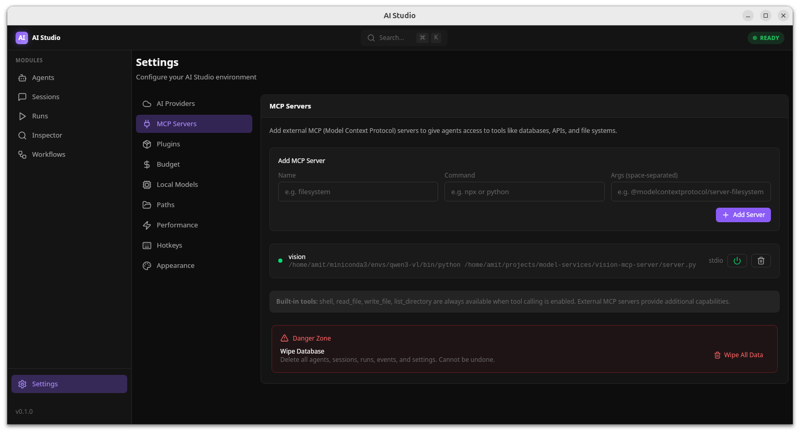
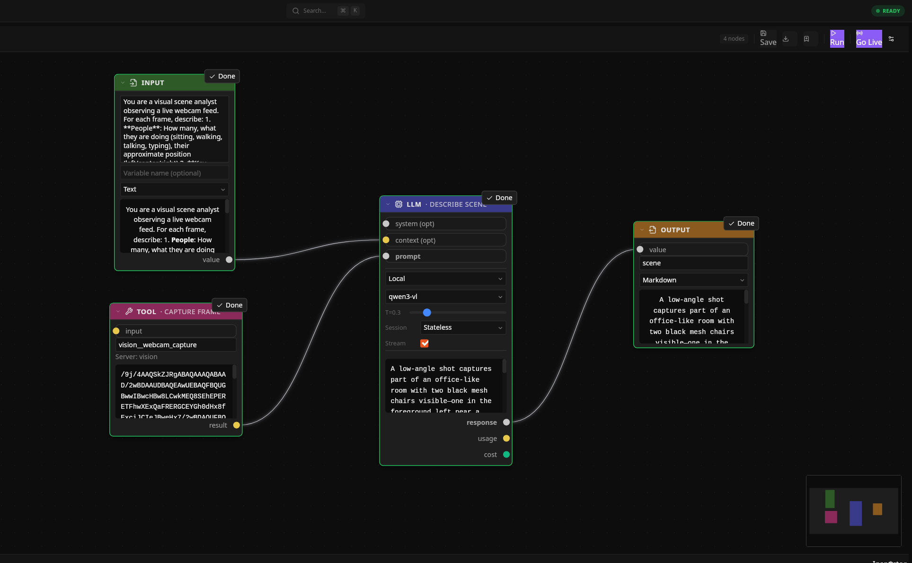
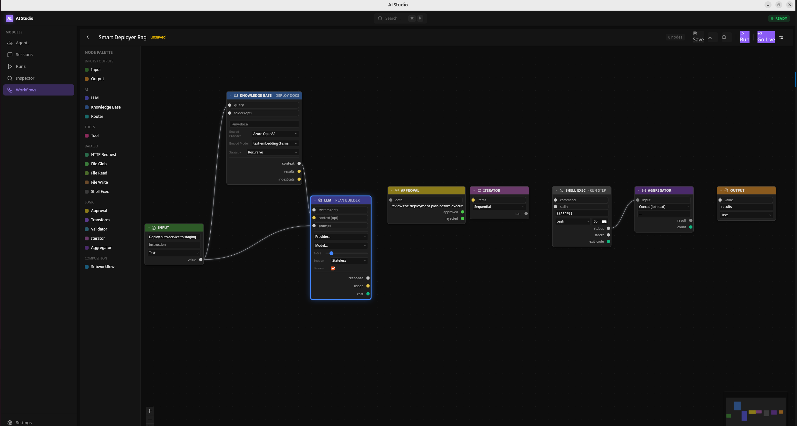

<p align="center">
  
</p>
<p align="center">
  <em><small>[Placeholder: Add a demo.gif here showing a live workflow execution with streaming output and Inspector updates]</small></em>
</p>

<h1 align="center">AI Studio</h1>

<p align="center">
  <strong>The open-source IDE for AI agents.</strong><br>
  Build, run, debug, and compare AI agents — with full visibility into every decision and dollar spent.
</p>

<p align="center">
  <a href="#visual-workflow-engine">Workflows</a> &middot;
  <a href="#agent-inspector">Inspector</a> &middot;
  <a href="#quick-start">Quick Start</a> &middot;
  <a href="#architecture">Architecture</a> &middot;
  <a href="#roadmap">Roadmap</a>
</p>

<p align="center">
  <a href="https://github.com/akv004/ai-studio-template/stargazers"></a>
  
  
  
  
</p>

---

## What is AI Studio?

**"Unreal Blueprints for AI agents"** — a desktop IDE where you build AI workflows visually, run them locally, and see exactly what happens at every step.

<!-- TODO: Replace with actual demo GIF -->
<!--  -->

> Drag a **Knowledge Base** node, connect it to an **LLM**, wire in an **Approval** gate, and hit Run.
> Watch tokens stream through your pipeline in real time. Click any node in the **Inspector** to see the exact input, output, latency, and cost.
> Something wrong? Edit a node, re-run from that point. Your data never leaves your machine.

**No servers. No accounts. No cloud bills you didn't expect.**

---

## Why AI Studio?

| Feature | SaaS Chat UIs | Cloud Workflow Builders | **AI Studio** |
|---------|---------------|-------------------------|---------------|
| **Full Inspector (traces, replay, branch)** | No | No | **Yes** |
| **Visual pipeline builder** | No | Yes | **Yes (+ local engine)** |
| **Hybrid intelligence (auto-pick model)** | No | No | **Yes** |
| **Local-first (data stays on machine)** | No | Partial | **Yes (SQLite)** |
| **MCP-native tool system** | Limited | No | **Full Support** |
| **Cost tracking per message** | No | No | **Yes** |
| **Approval rules for safety** | N/A | Minimal | **Full rules engine** |
| **Open source & Desktop native** | No | No | **Yes (MIT)** |

---

## Visual Workflow Engine

<p align="center">
  
</p>

### Node Editor — Visual AI Pipelines

**"Unreal Blueprints for AI agents."** Build complex AI workflows by connecting nodes — no code required:

- **16 Node Types** — Input, Output, LLM, Tool, Router, Approval, Transform, Subworkflow, HTTP Request, File Read/Write, File Glob, Iterator, Aggregator, Shell Exec, Validator.
- **Live Workflow Mode** — Watch real-time multi-agent interactions unfold with continuous, cooperative cancellation loops and live data feeds.
- **DAG Execution Engine** — Topological sort with cycle detection, 129 unit tests.
- **Live Execution View** — Watch data flow through nodes with status badges and cost per node.
- **13 Bundled Templates** — Including Smart Deployer, Hybrid Intelligence (Ensemble Synthesis), RAG Search, Team Assistant, and Computer Vision pipelines.
- **Export/Import & User Templates** — Share workflows as JSON files or save them as reusable templates.
- **Blender-inspired UI** — Dark theme, typed edges, inline editing, collapsible nodes, context menu + keyboard shortcuts.

---

## Agent Inspector

**"Chrome DevTools for AI agents."** No other tool gives you this level of visibility:

- **Event timeline** — every message, LLM call, tool execution as a navigable timeline
- **Tool call deep-dive** — click any tool call to see input, output, approval status, duration
- **Token and cost tracking** — per-turn and cumulative, with model-specific pricing
- **Session branching** — fork from any point, try different models, diff results
- **Export** — full session as JSON or Markdown
- **Keyboard navigation** — arrow keys, vim-style, filter chips

---

## Hybrid Intelligence

AI Studio auto-picks the best model for each step:

- **Simple questions** — local model (free, private, fast)
- **Complex reasoning** — cloud model (best quality)
- **Vision tasks** — vision-capable model
- **Large context** — high-context model (1M tokens)
- **3 routing modes** — single (passthrough), auto (built-in rules), manual (your rules)
- **Budget controls** — monthly limits, automatic fallback, enforcement modes: `local_only`, `cheapest_cloud`, `ask`

### 6 LLM Providers

<p align="center">
  
</p>

| Provider | Streaming | Vision | Notes |
|----------|-----------|--------|-------|
| Ollama | NDJSON | Via multimodal models | Local, free |
| OpenAI | SSE | GPT-4o | Direct API |
| Azure OpenAI | SSE | GPT-4o | Enterprise |
| Google AI | SSE | Gemini | 1M context |
| Anthropic | Event SSE | Claude | Best at code |
| Local/OpenAI-Compatible | SSE | Qwen-VL, etc. | Any OpenAI-compatible server |

---

## MCP-Native Tools

Built on [Model Context Protocol](https://modelcontextprotocol.io/) — the open standard for AI tool integration:

<p align="center">
  
</p>

- Connect any MCP server (GitHub, Postgres, Filesystem, Brave Search, and growing)
- Built-in tools: shell execution, filesystem operations
- One-click setup from curated server list
- Full approval workflow for every tool call

---

## Plugin System

Extend AI Studio with third-party capabilities:

- Plugins live in `~/.ai-studio/plugins/` with a `plugin.json` manifest
- Communicate via stdio JSON-RPC (MCP protocol)
- Permission declarations (network, filesystem, shell, env)
- Enable/disable/scan from Settings UI
- Auto-connect on startup, full lifecycle management

---

## Streaming, Rich Output & Vision

<p align="center">
  
</p>

- **SSE token streaming** — watch tokens flow through LLM nodes in real time. All 6 providers supported.
- **Rich output rendering** — markdown, JSON tables, code blocks, and collapsible trees everywhere: canvas preview, Inspector, Sessions, Runs.
- **Data I/O pipeline** — load documents with **File Glob**, loop with **Iterator**, combine with **Aggregator**, transform with **JSONPath + expressions**.
- **Vision pipeline** — pipe images through LLM nodes from webcam, file read, or MCP tools. Multi-image support for providers like Qwen3-VL.

---

## 6 Modules

| Module | What It Does |
|--------|-------------|
| **Agents** | Create and configure AI agents (model, prompt, tools, permissions, routing) |
| **Sessions** | Interactive chat with real-time tool approval and streaming |
| **Runs** | Headless batch execution — CI/CD for agents |
| **Inspector** | Deep-dive into any session: timeline, traces, cost, replay |
| **Workflows** | Visual pipeline builder — connect 16+ nodes to orchestrate behavior |
| **Settings** | Providers, MCP servers, plugins, budget, hotkeys, appearance |

---

## Quick Start

### Prerequisites

| Tool | Version | Required |
|------|---------|----------|
| **Node.js** | 18+ | Yes |
| **Rust** | Latest stable | Yes (for Tauri desktop) |
| **Python** | 3.10+ | Yes (for AI sidecar) |
| **pnpm** | 8+ | Yes (monorepo package manager) |

> **Tauri system dependencies**: On Linux, you may need additional packages. See the [Tauri prerequisites](https://v2.tauri.app/start/prerequisites/).

### Install

```bash
# 1. Clone
git clone https://github.com/akv004/ai-studio-template.git
cd ai-studio-template

# 2. Install Tauri CLI (first time only)
cargo install tauri-cli

# 3. Install dependencies
npm install

# 4. Install Python dependencies
cd apps/sidecar
python -m venv .venv && source .venv/bin/activate  # recommended
pip install -r requirements.txt
cd ../..

# 5. Run (full desktop app)
cd apps/desktop && pnpm tauri dev
```

First build takes ~3-5 minutes (Rust compilation). After that, it's instant.

### Other Run Modes

```bash
# Web UI only (for frontend development)
npm run dev

# Sidecar only (API development)
cd apps/sidecar && python -m uvicorn server:app --port 8765
# Swagger docs at http://localhost:8765/docs

# Docker (sidecar + Ollama)
docker compose up
```

### Connect a Model

**Local (free)**: Install [Ollama](https://ollama.ai), pull a model (`ollama pull llama3.2`), AI Studio auto-detects it. Or run any OpenAI-compatible server (vLLM, llama.cpp, etc.) and add it as a Local provider in Settings.

**Cloud**: Open Settings, add your API key for OpenAI, Anthropic, Google AI, or Azure OpenAI.

<details>
<summary><strong>Detailed Setup Guide</strong> (first-time setup, per-OS instructions)</summary>

#### Install Node.js

```bash
# macOS (Homebrew)
brew install node

# Windows (Chocolatey)
choco install nodejs

# Or download from https://nodejs.org/
```

#### Install Rust (Required for Tauri)

```bash
# macOS / Linux
curl --proto '=https' --tlsv1.2 -sSf https://sh.rustup.rs | sh

# When prompted, select: 1) Proceed with standard installation
# Then restart your terminal or run:
source ~/.cargo/env

# Verify
rustc --version
```

#### Install Tauri CLI

```bash
cargo install tauri-cli
```

> First time takes ~2-3 minutes (compiles 700+ crates).

</details>

<details>
<summary><strong>Docker Setup</strong> (sidecar + Ollama, GPU support)</summary>

```bash
# CPU mode
docker compose up

# GPU mode (requires nvidia-container-toolkit)
docker compose --profile gpu up
```

</details>

---

## Architecture

```
+--------------------------------------------------+
|              UI Layer (React 19 + Tauri)          |
|  Agents | Sessions | Runs | Inspector | Workflows|
+--------------------+-----------------------------+
                     | Tauri IPC
+--------------------+-----------------------------+
|            Desktop Layer (Rust/Tauri 2)           |
|  SQLite DB | Smart Router | Approval | Events    |
|  Workflow Engine (DAG walker, 16 node executors)  |
|  SSE Stream Proxy | Budget Enforcement            |
+--------------------+-----------------------------+
                     | HTTP + WebSocket
+--------------------+-----------------------------+
|            Sidecar (Python FastAPI)               |
|  6 LLM Providers | MCP Client | Event Emitter    |
|  Streaming (/chat/stream) | Tool Execution        |
+--------------------------------------------------+
```

**3 layers, clear responsibilities:**

- **UI (React 19)** — what you see. Never talks to the sidecar directly.
- **Desktop (Rust/Tauri 2)** — security boundary. SQLite persistence, smart model router, tool approval, event bridging, workflow DAG engine, SSE stream proxy.
- **Sidecar (Python FastAPI)** — does the work. Calls LLMs, executes tools, streams tokens, emits events.

**Key design decisions:**
- **Local-first**: All data in SQLite on your machine. No cloud, no account.
- **Event-sourced**: Every agent action is a typed event. Inspector reads from the event log.
- **MCP-native**: Tools are MCP servers. Interoperable with Claude Desktop, Cursor, Zed, etc.
- **Hybrid intelligence**: Smart router picks the best model per step with budget awareness.
- **Spec-driven**: Every feature has a [design specification](docs/specs/) written before implementation.

### Tech Stack

| Layer | Technology |
|-------|-----------|
| Desktop Shell | Tauri 2.0 (Rust) |
| UI | React 19 + TypeScript + Vite |
| Styling | Tailwind CSS 4 |
| State | Zustand |
| Database | SQLite (WAL mode, via rusqlite) |
| AI Backend | FastAPI (Python 3.10+) |
| LLM Providers | Ollama, OpenAI, Azure OpenAI, Google AI, Anthropic, Local/OpenAI-Compatible |
| Tool System | Model Context Protocol (MCP) |
| Node Editor | React Flow (@xyflow/react) |
| Smart Router | Rust (3 modes: single, auto, manual) |

---

## Project Structure

```
ai-studio-template/
├── apps/
│   ├── ui/                  # React frontend (6 modules)
│   │   └── src/app/pages/   # AgentsPage, SessionsPage, WorkflowsPage, etc.
│   ├── desktop/src-tauri/   # Tauri/Rust backend
│   │   └── src/
│   │       ├── commands/    # 14 command modules (agents, chat, workflows, etc.)
│   │       ├── workflow/    # DAG engine, validators, 16 node executors
│   │       ├── routing.rs   # Smart model router
│   │       └── db.rs        # SQLite schema v7 + migrations
│   └── sidecar/             # Python (6 LLM providers, MCP, tools, events)
├── packages/
│   └── shared/              # Shared TypeScript types
├── docs/
│   └── specs/               # 20+ design specifications
└── package.json             # Monorepo workspace config
```

---

## Keyboard Shortcuts

| Shortcut | Action |
|----------|--------|
| `Cmd+K` | Command Palette |
| `Cmd+1-5` | Navigate modules (Agents, Sessions, Runs, Inspector, Workflows) |
| `Cmd+,` | Settings |
| `Cmd+N` | New agent |
| `Cmd+Shift+N` | New session |
| `Del` | Delete selected node (Workflows) |
| `Ctrl+A` | Select all nodes (Workflows) |
| `Ctrl+C/V` | Copy/paste nodes (Workflows) |

---

## Roadmap

| Phase | Focus | Status |
|-------|-------|--------|
| **Phase 1** | Core loop — agents, sessions, persistence, events, inspector, MCP | Done |
| **Phase 2** | Polish — session branching, cost tracking, inspector improvements, onboarding | Done |
| **Phase 3** | Node editor, hybrid intelligence, plugin system | Done |
| **Phase 4** | Universal automation — 16 custom node types, data I/O nodes, streaming, multi-images, canvas UX | Done |
| **Phase 5** | Killer Features — A/B Eval, Time-Travel Debug, RAG Knowledge Base | **In progress (Phase 5C)** |

### What's Built

- SQLite local-first persistence (WAL mode, schema v7, 7 migrations)
- 5+ LLM providers (Ollama, Anthropic, OpenAI, Google AI, Azure, LocalOpenAI compatible modes)
- MCP-native tool system with registry, approval rules, and stdio client
- Multi-turn tool calling with event-sourced audit trail
- Agent Inspector with timeline, grouping, filters, keyboard nav, markdown export
- Session branching (fork-and-compare)
- Headless runs with async background execution
- Node Editor with **16** custom node types, React Flow canvas, DAG execution engine
- Smart model router (3 modes: single, auto, manual)
- Budget tracking with monthly limits and runtime enforcement
- Plugin system with manifest scanning and Settings UI
- Blender-inspired node styling, context menus, inline editing, and visual typed edges
- **13** bundled workflow templates + Save/Load JSON user template functionality
- **129+** Rust unit tests across routing, workflow validation, template resolution, and sidecar API integration
- SSE Token Streaming functionality directly rendering responsive blocks mid-flight.
- Playwright E2E UI automation structure with Tauri IPC mocks via 30+ custom test commands

<p align="center">
  
</p>

- **RAG Knowledge Base** — point a workflow at a folder of documents, get answers with source citations (file + line number + relevance score). Zero-server, file-based vector index, works offline.

### Coming Next

- **A/B Eval Node** — send the same prompt to multiple models in parallel, compare outputs side-by-side with latency, cost, and quality metrics.
- **Time-Travel Debug** — click any completed node, edit its output, re-run the pipeline from that point. No wasted tokens.

See [STATUS.md](STATUS.md) for the detailed sprint board.

---

## Building for Production

```bash
cd apps/desktop && pnpm tauri build
```

Creates platform-specific installers:
- **macOS**: `.dmg` + `.app` bundle
- **Windows**: `.msi` + `.exe` installer
- **Linux**: `.deb` + `.AppImage`

---

## Contributing

We welcome contributions! See [CONTRIBUTING.md](CONTRIBUTING.md) for guidelines.

Check [STATUS.md](STATUS.md) for open tasks, or look at issues labeled `good first issue`.

---

## License

MIT

---

<p align="center">
  <strong>AI Studio</strong> — See everything. Control everything. Own your AI.<br>
  Built with Tauri 2, React 19, and Python.
</p>
